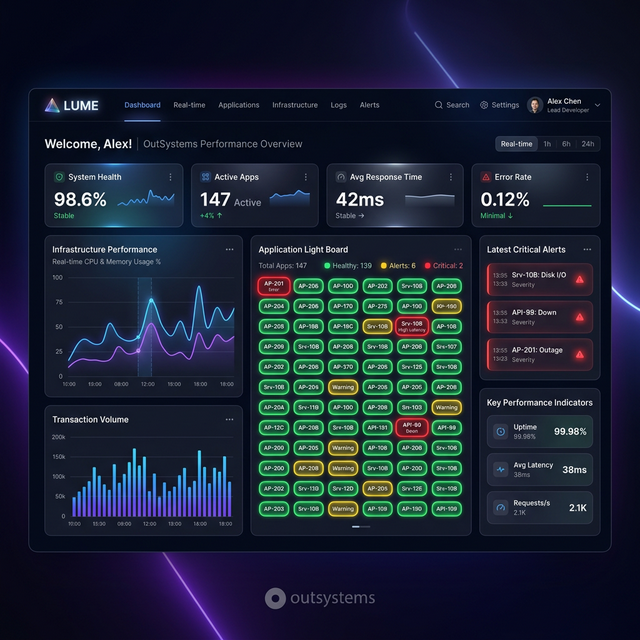
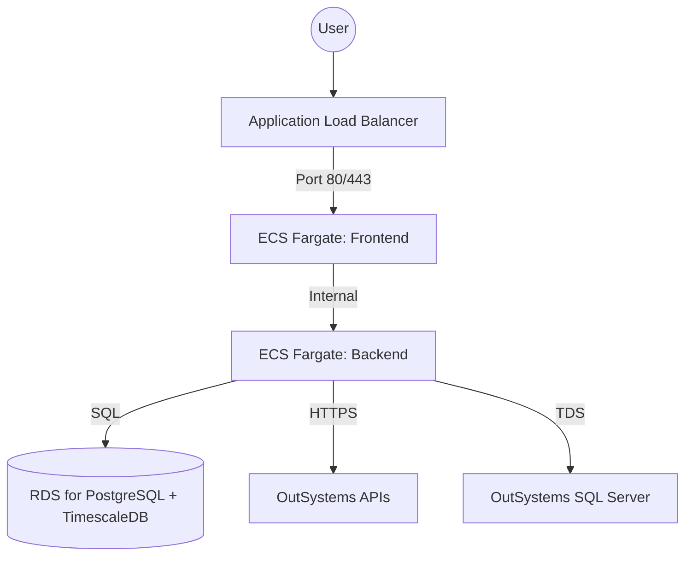

# Lume - OutSystems Infrastructure Monitoring 🕯️

Lume is a high-performance, real-time monitoring solution designed specifically for OutSystems infrastructure. It "illuminates" the health of your environment using modern tech stacks and premium visual feedback, providing actionable insights into performance and reliability.



## 🌟 Key Features

- **The Light Board (Real-time Health)**: A glassmorphism-inspired dashboard providing instant visual status of OutSystems nodes, request rates, and error frequencies.
- **Log Spotlight (Deep Search)**: An advanced log explorer with drill-down capabilities into `OSLOG_` tables and Performance Monitoring APIs.
- **Predictive Alerts**: A pattern-matching engine that identifies performance trends before they become critical issues.
- **OutSystems Integration**: Native support for PerformanceMonitoring API and direct consumption of SQL Server log tables.
- **Enterprise-Grade Security**: Integrated with AWS SSM (Parameter Store) and IAM for secure credential and log management.

## 🏗️ Architecture

Lume is built for scalability and security using a distributed containerized approach:



### Technical Components:
- **Frontend**: SvelteKit (Fast, reactive, low runtime overhead).
- **Backend**: Node.js + Fastify (High performance, low overhead).
- **Database**: TimescaleDB (PostgreSQL extension optimized for time-series monitoring data).
- **Infrastructure**: AWS ECS (Fargate), Application Load Balancer (ALB), and RDS.

## 🛠️ Infrastructure & Deployment

### Scalable Compute
Containers run on **AWS ECS Fargate** within Private Subnets for maximum isolation and security. Public traffic is managed by an **Application Load Balancer (ALB)**, handling path-based routing (`/api/*` to Backend, `/` to Frontend).

### Secure Configuration
- **AWS SSM Parameter Store**: Database and API credentials are retrieved at runtime.
- **IAM Policies**: Minimum privilege roles (ECS Task Execution Role) for ECR pulls and CloudWatch logging.

### CI/CD
Automated build and push to ECR via **GitHub Actions**. Deployment ensures zero-downtime through Fargate rolling updates.

## 🚀 Local Development

### Prerequisites
- Node.js 18+
- Docker & Docker Compose (optional for local DB)

### Setup
1. Clone the repository.
2. Initialize the database:
   ```bash
   docker-compose up -d database
   ```
3. Run Backend:
   ```bash
   cd backend && npm install && npm run dev
   ```
4. Run Frontend:
   ```bash
   cd frontend && npm install && npm run dev
   ```

## 📈 Project Milestones & Reliability
During development, the infrastructure underwent rigorous testing and optimization:
- **IAM Hardening**: Transitioned to precise IAM policies for secure image pulling and centralized logging.
- **Service Resilience**: Resolved 503 error states by ensuring health check grace periods and proper task life-cycle management.
- **Security Compliance**: Implemented host validation in Vite to secure frontend traffic coming from the Load Balancer.

---
*Developed for high-performance OutSystems monitoring as part of a Master's Thesis.*
